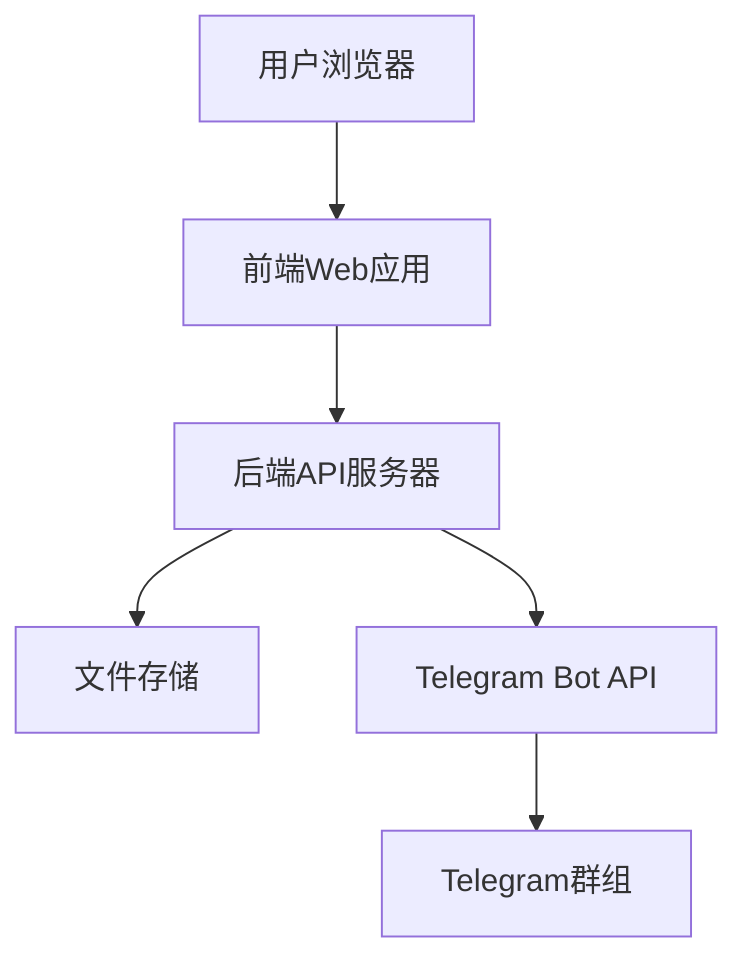

# 设计文档

## 概述

Telegram媒体上传器是一个Web应用程序，允许用户通过简单的拖放界面上传图片和视频文件，并自动将这些文件转发到指定的Telegram群组。系统采用前后端分离的架构，前端提供用户友好的上传界面，后端处理文件上传和Telegram API集成。

## 架构

### 系统架构图



### 技术栈

**前端：**
- HTML5/CSS3/JavaScript
- 现代浏览器File API支持拖放上传
- 响应式设计支持移动设备

**后端：**
- Node.js + Express.js
- Multer用于文件上传处理
- Axios用于HTTP请求到Telegram API
- 临时文件存储（上传后删除）

## 组件和接口

### 前端组件

#### 1. 上传界面组件 (UploadInterface)
- **功能：** 提供拖放和点击上传功能
- **状态管理：** 跟踪上传进度和文件状态
- **视觉反馈：** 拖拽悬停效果、进度条、成功/失败状态

#### 2. 文件列表组件 (FileList)
- **功能：** 显示选中的文件列表
- **信息显示：** 文件名、大小、类型、上传状态
- **操作：** 移除文件、重试失败的上传

#### 3. 进度指示器组件 (ProgressIndicator)
- **功能：** 显示单个文件和整体上传进度
- **状态：** 等待中、上传中、发送到Telegram、完成、失败

### 后端API接口

#### 1. 文件上传接口
```
POST /api/upload
Content-Type: multipart/form-data

请求体：
- files: 一个或多个文件

响应：
{
  "success": true,
  "results": [
    {
      "filename": "image1.jpg",
      "status": "success",
      "telegramMessageId": 123
    },
    {
      "filename": "video1.mp4",
      "status": "failed",
      "error": "文件太大"
    }
  ]
}
```

#### 2. 上传状态查询接口
```
GET /api/upload/status/:uploadId

响应：
{
  "uploadId": "uuid",
  "status": "processing",
  "progress": 75,
  "files": [...]
}
```

### Telegram Bot API集成

#### 发送图片
```
POST https://api.telegram.org/bot{token}/sendPhoto
{
  "chat_id": "@群组用户名或群组ID",
  "photo": "文件数据"
}
```

#### 发送视频
```
POST https://api.telegram.org/bot{token}/sendVideo
{
  "chat_id": "@群组用户名或群组ID",
  "video": "文件数据"
}
```

## 数据模型

### 上传会话模型 (UploadSession)
```javascript
{
  id: String,           // 唯一标识符
  files: [FileUpload],  // 文件列表
  createdAt: Date,      // 创建时间
  status: String        // 'pending', 'processing', 'completed', 'failed'
}
```

### 文件上传模型 (FileUpload)
```javascript
{
  filename: String,     // 原始文件名
  size: Number,         // 文件大小（字节）
  mimetype: String,     // MIME类型
  status: String,       // 'pending', 'uploading', 'sending', 'success', 'failed'
  progress: Number,     // 上传进度 (0-100)
  telegramMessageId: Number, // Telegram消息ID
  error: String         // 错误信息（如果失败）
}
```

## 错误处理

### 客户端错误处理
1. **文件类型验证：** 在前端验证文件类型，只允许图片和视频
2. **网络错误：** 显示网络连接问题并提供重试选项
3. **上传超时：** 设置合理的超时时间并提供重试机制

### 服务器端错误处理
1. **Telegram API错误：**
   - 401 Unauthorized: Bot token无效
   - 429 Too Many Requests: 实施指数退避重试
   - 413 Payload Too Large: 文件过大（虽然需求说无限制，但Telegram有限制）
   
2. **文件处理错误：**
   - 磁盘空间不足
   - 文件损坏
   - 不支持的文件格式

3. **重试机制：**
   - 指数退避算法：1s, 2s, 4s, 8s, 16s
   - 最大重试次数：5次
   - 记录失败原因供用户查看

## 测试策略

### 单元测试
1. **前端组件测试：**
   - 文件拖放功能
   - 进度显示准确性
   - 错误状态处理

2. **后端API测试：**
   - 文件上传处理
   - Telegram API集成
   - 错误处理逻辑

### 集成测试
1. **端到端测试：**
   - 完整的文件上传流程
   - 多文件并发上传
   - 网络中断恢复

2. **Telegram集成测试：**
   - 实际发送到测试群组
   - API限制处理
   - 不同文件类型和大小

### 性能测试
1. **负载测试：**
   - 大文件上传性能
   - 并发用户处理能力
   - 内存使用优化

2. **压力测试：**
   - Telegram API速率限制处理
   - 服务器资源消耗
   - 文件存储空间管理

## 安全考虑

### 文件安全
1. **文件类型验证：** 严格验证MIME类型和文件扩展名
2. **文件大小控制：** 虽然需求无限制，但需要合理的服务器保护
3. **恶意文件检测：** 基本的文件内容扫描

### API安全
1. **Bot Token保护：** 环境变量存储，不在前端暴露
2. **速率限制：** 防止API滥用
3. **CORS配置：** 适当的跨域资源共享设置

### 数据隐私
1. **临时存储：** 文件发送后立即删除
2. **日志管理：** 不记录敏感信息
3. **传输加密：** HTTPS通信